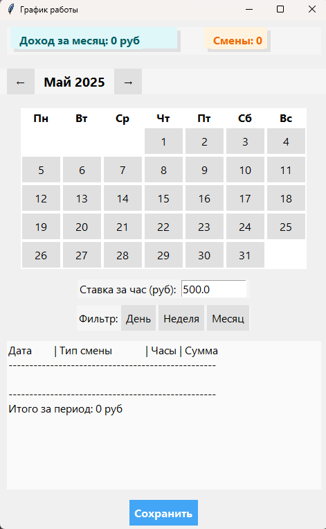

# Приложение "График работы"

Это приложение на Python с графическим интерфейсом (GUI), разработанное с использованием библиотеки Tkinter, для управления графиком работы, учета смен, расчета доходов и сохранения данных.

## Описание

Приложение "График работы" позволяет:

*   **Вести график смен:** Добавлять, изменять и просматривать график работы на месяц.
*   **Учитывать разные типы смен:** Дневная, ночная, выходной, больничный, отгул.
*   **Рассчитывать доход:** Автоматически рассчитывать доход за месяц на основе установленной почасовой ставки и количества отработанных часов.
*   **Фильтровать данные:** Просматривать график за день, неделю или месяц.
*   **Сохранять и загружать данные:** Сохранять график в файл `schedule.json` и загружать его при запуске приложения.
*   **Удобный интерфейс:** Интуитивно понятный интерфейс с календарем и кнопками управления.
*   **Современный дизайн:** Приятный глазу дизайн с использованием стилей Tkinter.

## Скриншоты




## Возможности

*   **Календарь:** Отображение календаря с возможностью переключения между месяцами.
*   **Выбор смены:** Всплывающее окно для выбора типа смены для конкретного дня.
*   **Цветовая индикация:** Разные типы смен выделяются разными цветами.
*   **Статистика:** Отображение дохода за месяц и количества смен.
*   **Почасовая ставка:** Возможность задать почасовую ставку.
*   **Фильтры:** Фильтрация данных по дню, неделе или месяцу.
*   **Сохранение:** Автоматическое и ручное сохранение данных.
*   **Загрузка:** Автоматическая загрузка данных при запуске.
*   **Современный дизайн:** Использование стилей Tkinter для создания современного интерфейса.

## Установка

### Необходимые компоненты

*   **Python 3.x:** Приложение написано на Python 3.x. Убедитесь, что он установлен на вашем компьютере.
*   **Tkinter:** Библиотека Tkinter обычно входит в стандартную поставку Python. Если она не установлена, установите ее с помощью пакетного менеджера вашей операционной системы (например, `sudo apt-get install python3-tk` для Debian/Ubuntu).

### Шаги установки

1.  **Скачайте код:** Скачайте файл `ScheduleShift.py` из репозитория.
2.  **Запустите приложение:** Откройте терминал или командную строку, перейдите в директорию, куда вы скачали файл, и выполните команду:

    ```bash
    python ScheduleShift.py
    ```

## Использование

1.  **Запуск:** Запустите приложение, выполнив команду `python ScheduleShift.py`.
2.  **Навигация по календарю:** Используйте кнопки "←" и "→" для переключения между месяцами.
3.  **Выбор смены:** Нажмите на кнопку с датой, чтобы выбрать тип смены для этого дня. Появится всплывающее окно с вариантами смен.
4.  **Установка ставки:** Введите почасовую ставку в поле "Ставка за час (руб)".
5.  **Фильтрация:** Используйте кнопки "День", "Неделя" и "Месяц" для фильтрации отображаемых данных.
6.  **Просмотр графика:** В текстовом поле отображается график работы с информацией о типе смены, количестве часов и сумме за смену.
7.  **Сохранение:** Нажмите кнопку "Сохранить", чтобы сохранить график в файл `schedule.json`. Данные также сохраняются автоматически при закрытии приложения и при изменении смены.

## Сохранение в формате .ipw и создание ярлыка

Для создания ярлыка на рабочем столе, который будет запускать приложение, можно использовать формат `.ipw` (Internet Shortcut). Однако, напрямую создать `.ipw` для Python-скрипта не получится, так как это формат для веб-ссылок. Вместо этого, мы создадим ярлык, который будет запускать Python-интерпретатор с вашим скриптом.

### Шаги для создания ярлыка:

1.  **Создайте ярлык:**
    *   Кликните правой кнопкой мыши на рабочем столе.
    *   Выберите "Создать" -> "Ярлык".
2.  **Укажите путь к интерпретатору Python:**
    *   В поле "Укажите расположение объекта" введите путь к вашему интерпретатору Python, а затем через пробел путь к вашему скрипту. Пример:
        ```
        C:\Python39\python.exe D:\python\repositories\Python\Рабочие смены\ScheduleShift.py
        ```
        *   Замените `C:\Python39\python.exe` на путь к вашему Python.
        *   Замените `D:\python\repositories\Python\Рабочие смены\ScheduleShift.py` на путь к вашему скрипту.
3.  **Назовите ярлык:**
    *   Нажмите "Далее".
    *   Введите имя ярлыка, например, "График работы".
    *   Нажмите "Готово".
4. **Измените иконку (опционально):**
    * Кликните правой кнопкой мыши на созданном ярлыке.
    * Выберите "Свойства".
    * Перейдите на вкладку "Ярлык".
    * Нажмите кнопку "Сменить значок".
    * Выберите иконку, которая вам нравится.
    * Нажмите "ОК".

Теперь у вас есть ярлык на рабочем столе, который запускает ваше приложение "График работы".

## Файлы проекта

*   `ScheduleShift.py`: Основной файл с кодом приложения.
*   `schedule.json`: Файл для сохранения и загрузки данных графика (создается автоматически при первом сохранении).

## Благодарности

*   Всем, кто помогал в разработке и тестировании приложения.
*   Сообществу Python за поддержку и документацию.

## Лицензия

Данный проект распространяется под лицензией MIT.
