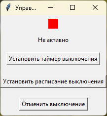

# Программа управления выключением компьютера

Это приложение с графическим интерфейсом на Python, позволяющее запланировать автоматическое выключение компьютера по таймеру или по расписанию.



## Возможности программы

- 🕒 Установка таймера выключения (через указанное количество минут)
- 📅 Настройка ежедневного расписания выключения (в указанное время)
- ❌ Отмена запланированного выключения
- 🔴🟢 Индикация текущего статуса (активно/неактивно)
- 🔄 Отображение оставшегося времени до выключения

## Требования

- Windows OS
- Python 3.6 или выше
- Установленные библиотеки:
  - tkinter (обычно поставляется с Python)
  - Pillow (`pip install Pillow`)
  - schedule (`pip install schedule`)

## Структура файлов

```
shutdown_manager/
│
├── shutdown_manager.pyw    # Основной файл программы
├── red_circle.png          # Изображение красного индикатора
└── green_circle.png        # Изображение зеленого индикатора
```

## Установка

1. Создайте папку для программы, например, `C:\Programs\ShutdownManager`
2. Сохраните код в файл `shutdown_manager.pyw` в эту папку
3. Скачайте или создайте изображения красного и зеленого кругов и сохраните их как `red_circle.png` и `green_circle.png` в ту же папку
   - Размер рекомендуется примерно 100x100 пикселей (программа автоматически изменит размер до 20x20)
   - Используйте изображения в формате PNG с прозрачным фоном для лучшего внешнего вида

## Запуск программы

### Метод 1: Прямой запуск файла

Просто дважды щелкните по файлу `shutdown_manager.pyw` в проводнике Windows.

### Метод 2: Создание ярлыка на рабочем столе (рекомендуется)

1. Щелкните правой кнопкой мыши на рабочем столе
2. Выберите "Создать" → "Ярлык"
3. В поле "Расположение объекта" введите: 
   ```
   pythonw.exe "C:\Programs\ShutdownManager\shutdown_manager.pyw"
   ```
   (замените путь на фактическое расположение вашего файла)
4. Нажмите "Далее"
5. Введите имя для ярлыка, например "Управление выключением"
6. Нажмите "Готово"

### Настройка свойств ярлыка

После создания ярлыка рекомендуется настроить его свойства:

1. Щелкните правой кнопкой мыши по созданному ярлыку
2. Выберите "Свойства"
3. Вкладка "Ярлык":
   - **Объект:** `pythonw.exe "C:\Programs\ShutdownManager\shutdown_manager.pyw"`
   - **Рабочая папка:** `C:\Programs\ShutdownManager`
   - По желанию можно установить комбинацию клавиш для быстрого запуска
4. Вкладка "Совместимость":
   - При необходимости можно выбрать "Запускать от имени администратора"
5. Нажмите "ОК"

## Использование программы

### Установка таймера выключения

1. Нажмите кнопку "Установить таймер выключения"
2. Введите количество минут через которое компьютер должен выключиться
3. Нажмите "Установить таймер"
4. Индикатор станет зеленым, показывая, что таймер активен

### Установка расписания выключения

1. Нажмите кнопку "Установить расписание выключения"
2. Введите время в 24-часовом формате (HH:MM), например "22:30"
3. Нажмите "Установить расписание"
4. Индикатор станет зеленым, показывая, что расписание активно

### Отмена выключения

1. Нажмите кнопку "Отменить выключение"
2. Появится сообщение о подтверждении отмены
3. Индикатор станет красным, показывая, что выключение не запланировано

## Индикаторы статуса

- 🔴 **Красный индикатор**: Выключение не запланировано
- 🟢 **Зеленый индикатор**: Активно запланированное выключение
- Текст под индикатором показывает текущий статус:
  - "Не активно" - нет запланированного выключения
  - "Таймер: X мин" - осталось X минут до выключения
  - "Расписание: HH:MM" - компьютер будет выключен в указанное время

## Автозапуск при старте Windows

Для автоматического запуска программы при загрузке Windows:

1. Щелкните правой кнопкой мыши по ярлыку программы
2. Выберите "Копировать"
3. Нажмите Win+R, введите `shell:startup` и нажмите Enter
4. В открывшейся папке щелкните правой кнопкой мыши и выберите "Вставить ярлык"

## Устранение неполадок

### Ошибка при загрузке изображений

Если при запуске появляется ошибка о ненайденных изображениях:
1. Убедитесь, что файлы `red_circle.png` и `green_circle.png` находятся в той же папке, что и `shutdown_manager.pyw`
2. Проверьте, что имена файлов написаны корректно (регистр учитывается)
3. Убедитесь, что указанный в ярлыке путь к рабочей папке верный

### Программа не выключает компьютер

1. Убедитесь, что скрипт запущен с правами администратора
2. Проверьте, активен ли индикатор (должен быть зеленым)
3. Проверьте, не блокируют ли другие программы выключение

## Примечание по безопасности

Программа использует системные команды для выключения компьютера. Будьте осторожны: при активном таймере компьютер будет выключен без дополнительных запросов подтверждения по истечении установленного времени.

## Технические детали

- Для прямого выключения без отсрочки используется команда Windows `shutdown /s /t 1`
- Для отмены запланированного выключения используется команда `shutdown /a`
- Программа сохраняет свое состояние только во время работы, при закрытии все запланированные задачи отменяются
- Расширение `.pyw` используется вместо `.py` для запуска Python без отображения консольного окна